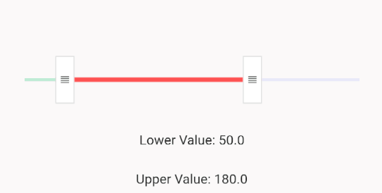
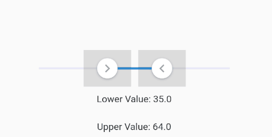

# flutter_slider

A material design slider and range slider with rtl support and lots of options and customizations for flutter


## Get Started

### Single Slider

A single slider

```dart
FlutterSlider(
  values: [300],
  max: 500,
  min: 0,
  onDragging: (lowerValue, upperValue) {
    _lowerValue = lowerValue;
    _upperValue = upperValue;
    setState(() {});
  },
)
```


to make slider `Right To Left` use `rtl: true`

```dart
 FlutterSlider(
  ...
  rtl: true,
  ...
)
```


### Range Slider

A simple example of slider

```dart
FlutterSlider(
  values: [30, 420],
  rangeSlider: true,
  max: 500,
  min: 0,
  onDragging: (lowerValue, upperValue) {
    _lowerValue = lowerValue;
    _upperValue = upperValue;
    setState(() {});
  },
)
```


## Customization

### Handlers
You can customize handlers using `handler` and `rightHandler` properties.  
`width` and `height` are required for custom handlers, so we use `SizedBox` as a wrapper

**if you use `rangeSlider` then you should define `rightHandler` as well if you want to customize handlers**


here there is a range slider with customized handlers and trackbars
```dart
FlutterSlider(
  ...
  handler: SizedBox(
    width: 20,
    height: 50,
    child: Container(
      child: Icon(
        Icons.view_headline,
        color: Colors.black54,
        size: 13,
      ),
      decoration: BoxDecoration(
          color: Colors.white,
          border:
              Border.all(color: Colors.black.withOpacity(0.12))),
    ),
  ),
  rightHandler: SizedBox(
    width: 20,
    height: 50,
    child: Container(
      child: Icon(
        Icons.view_headline,
        color: Colors.black54,
        size: 13,
      ),
      decoration: BoxDecoration(
          color: Colors.white,
          border:
              Border.all(color: Colors.black.withOpacity(0.12))),
    ),
  ),
  ...
)

```

### Trackbars

```dart
FlutterSlider(
  ...
    activeTrackBarColor: Colors.redAccent,
    activeTrackBarHeight: 5,
    inactiveTrackBarHeight: 2,
    leftInactiveTrackBarColor: Colors.greenAccent.withOpacity(0.5),
  ...
)
```

### Tooltips

```dart
FlutterSlider(
  ...
  tooltipTextStyle: TextStyle(fontSize: 17, color: Colors.white),
  tooltipBox: FlutterSliderTooltip(
    decoration: BoxDecoration(
      color: Colors.red.withOpacity(0.5),
    )
  ),
  ...
)
```


## Controls

### Jump

by default slider handlers move fluently, if you set `jump` to true, handlers will jump between intervals

```dart
FlutterSlider(
  ...
  jump: true,
  ...
)
```

### divisions

The number of discrete divisions

```dart
FlutterSlider(
  ...
  divisions: 25,
  ...
)
```

### Ignore Steps

if you configurations requires that some steps are not available, you can use `ignoreSteps` property.  
this property accepts a simple class to define `from` and `to` ranges.

```dart
FlutterSlider(
  ...
    ignoreSteps: [
      SliderIgnoreSteps(from: 8000, to: 12000),
      SliderIgnoreSteps(from: 18000, to: 22000),
    ],
  ...
)
```



### Tooltip Number Format

you can customize tooltip numbers by using `NumberFormat` class  
here is an example  

```dart
FlutterSlider(
  ...
  tooltipNumberFormat: intl.NumberFormat(),
  // tooltipNumberFormat: intl.compact(),
  ...
)
```

you can find more about [NumberFormat](https://docs.flutter.io/flutter/intl/NumberFormat-class.html)


### Touch Zone

You can control how big a handler's touch area could be. by default touch zone is 2  
the range is between 1 to 5

```dart
FlutterSlider(
  ...
  touchZone: 2,
  ...
)
```

to see the touchable area for handlers you set `displayTestTouchZone` to true and test your slider

```dart
FlutterSlider(
  ...
  displayTestTouchZone: true,
  ...
)
```



### disabled

to disable your slider, you can use `disabled`. 

```dart
FlutterSlider(
  ...
  disabled: true,
  ...
)
```

### rtl

makes the slider `Right To Left`

```dart
FlutterSlider(
  ...
  rtl: true,
  ...
)
```

## Events

There are 3 events

`onDragStarted`: fires when drag starts
`onDragCompleted` fires when drag ends
`onDragging` keeps firing when dragging

all three of above functions returns two `double` values. `Lower Value` and `Upper Value`

```dart
FlutterSlider(
  ...
  onDragging: (lowerValue, upperValue) {
    _lowerValue = lowerValue;
    _upperValue = upperValue;
    setState(() {});
  },
  ...
)
```


