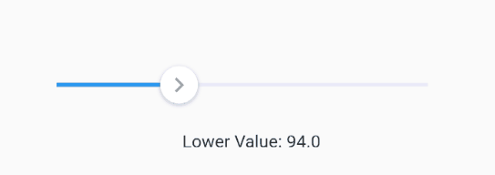
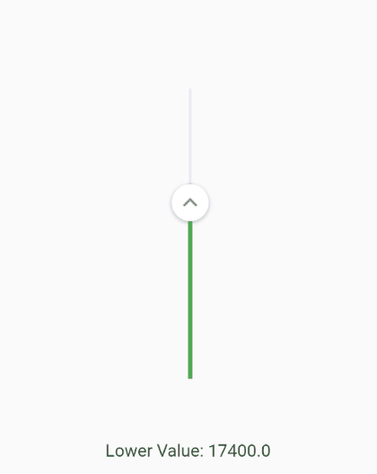
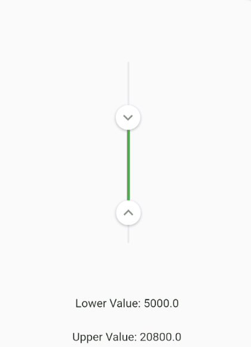
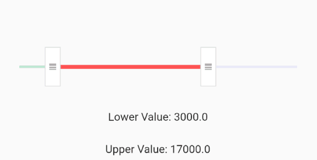
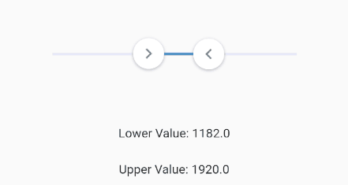
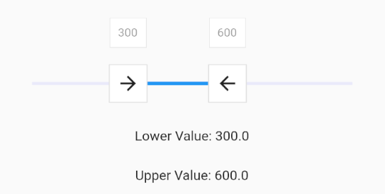
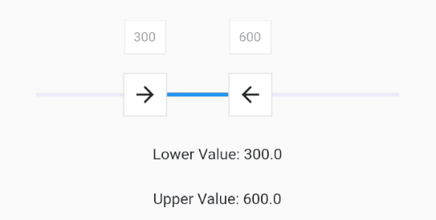
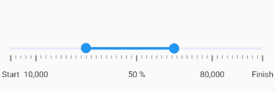

# flutter_xlider

(Flutter Slider) A material design slider and range slider, horizontal and vertical, with rtl support and lots of options and customizations for flutter

**Version 3.0.0 and above, breaks functionality of older versions**  
**Since version 3.0.0, Intl dependency is removed**


## Get Started

### Single Slider

A single slider

```dart
FlutterSlider(
  values: [300],
  max: 500,
  min: 0,
  onDragging: (handlerIndex, lowerValue, upperValue) {
    _lowerValue = lowerValue;
    _upperValue = upperValue;
    setState(() {});
  },
)
```



To make slider `Right To Left` use `rtl: true`

```dart
 FlutterSlider(
  ...
  rtl: true,
  ...
)
```


### Range Slider

A simple example of range slider

```dart
FlutterSlider(
  values: [30, 420],
  rangeSlider: true,
  max: 500,
  min: 0,
  onDragging: (handlerIndex, lowerValue, upperValue) {
    _lowerValue = lowerValue;
    _upperValue = upperValue;
    setState(() {});
  },
)
```


### Vertical Axis

You can change the axis of your slider by setting `axis` to `Axis.vertical`. Default is horizontal
```dart
FlutterSlider(
  ...
  axis: Axis.vertical,
  ...
)
```

 


## Handlers

You can customize handlers using `handler` and `rightHandler` properties.  
Both `handler` and `rightHandler` accept `FlutterSliderHandler` class which has following properties:  

1. `child`: is a widget
2. `disabled`: to disable the handler
3. `decoration`, `foregroundDecoration` and `transform` are come from `Container()` widget

```dart
FlutterSlider(
  ...
  handler: FlutterSliderHandler(
    decoration: BoxDecoration(),
    child: Material(
      type: MaterialType.canvas,
      color: Colors.orange,
      elevation: 3,
      child: Container(
          padding: EdgeInsets.all(5),
          child: Icon(Icons.adjust, size: 25,)),
    ),
  ),
  rightHandler: FlutterSliderHandler(
    child: Icon(Icons.chevron_left, color: Colors.red, size: 24,),
  ),
  ...
)
```


### Handler Scale Animation

You can control the scale animation type of your handlers, it's duration and it's scale size using `handlerAnimation`    
`handlerAnimation` accepts a `FlutterSliderHandlerAnimation` class which has 4 properties as following

```dart
FlutterSlider(
  ...
    handlerAnimation: FlutterSliderHandlerAnimation(
      curve: Curves.elasticOut,
      reverseCurve: Curves.bounceIn,
      duration: Duration(milliseconds: 500),
      scale: 1.5
    ),
  ...
)
```


**if you don't want scale animation, then just pass `1` to `scale` property**  
**if you don't want `reverseCurve`, just ignore it. default is null**


## Trackbars

To customize track bars you can use `FlutterSliderTrackBar`. [You can see the details here](https://pub.dartlang.org/documentation/flutter_xlider/latest/flutter_xlider/FlutterSliderTrackBar/FlutterSliderTrackBar.html)

```dart
FlutterSlider(
  ...
    trackBar: FlutterSliderTrackBar(
      activeTrackBarHeight: 5,
    ),
  ...
)
```


`inactiveTrackBarColor` and `activeTrackBarColor` properties are removed. use `inactiveTrackBar` and `activeTrackBar` instead.

```dart
FlutterSlider(
  ...
    trackBar: FlutterSliderTrackBar(
      inactiveTrackBar: BoxDecoration(
        borderRadius: BorderRadius.circular(20),
        color: Colors.black12,
        border: Border.all(width: 3, color: Colors.blue),
      ),
      activeTrackBar: BoxDecoration(
        borderRadius: BorderRadius.circular(4),
        color: Colors.blue.withOpacity(0.5)
      ),
    ),
  ...
)
```


### Central Widget

If you want to have a widget in the middle of your slider, you can use `centralWidget`

```dart
FlutterSlider(
  ...
    trackBar: FlutterSliderTrackBar(
        centralWidget: Container(
          decoration: BoxDecoration(
              color: trackBarColor,
            borderRadius: BorderRadius.circular(50)
          ),
          width: 9,
          height: 9,
        ),
    ),
  ...
)
```


## Tooltips

In order to customize your tooltips, you can use `FlutterSliderTooltip` class. [You can see all properties here](https://pub.dartlang.org/documentation/flutter_xlider/latest/flutter_xlider/FlutterSliderTooltip/FlutterSliderTooltip.html)

```dart
FlutterSlider(
  ...
  tooltip: FlutterSliderTooltip(
    textStyle: TextStyle(fontSize: 17, color: Colors.white),
    boxStyle: FlutterSliderTooltipBox(
      decoration: BoxDecoration(
        color: Colors.redAccent.withOpacity(0.7)
      )
    )
  ),
  ...
)
```

Here there is a range slider with customized handlers, trackbars and tooltips



### Tooltip Prefix

You can use `leftPrefix`, `leftSuffix`, `rightPrefix`, `rightSuffix` to add your desired widget around tooltip content.

```dart
FlutterSlider(
  ...
    tooltip: FlutterSliderTooltip(
      leftPrefix: Icon(Icons.attach_money, size: 19, color: Colors.black45,),
      rightSuffix: Icon(Icons.attach_money, size: 19, color: Colors.black45,),
    ),
  ...
)
```


### Tooltip Callback

If you want to fully change tooltip widget and use your own customized widget, you can use `custom` function.

```dart
FlutterSlider(
  ...
    tooltip: FlutterSliderTooltip(
      custom: (value) {
        return Text(value.toString());
      }
    ),
  ...
)
```


### Disable tooltip

To disable tooltips, use `disabled` in `FlutterSliderTooltip` class
```dart
FlutterSlider(
  ...
    tooltip: FlutterSliderTooltip(
      disabled: true,
    ),
  ...
)
```


### Always Show Tooltips

Tooltips always displayed if this property is set to `true`.

```dart
FlutterSlider(
  ...
  tooltip: FlutterSliderTooltip(
    alwaysShowTooltip: true,
  ),
  ...
)
```


## Controls

### Handlers width and height

By default both handlers size are 35 width and height, but you can change this by `handlerWidth` and `handlerHeight`

```dart
FlutterSlider(
  ...
  handlerWidth: 30,
  handlerHeight: 30,
  ...
)
```

### Select By Tap

You can tap on the slider to select it's value.  
if slider is range-slider, then the closest handler to the selected point will move to that point

```dart
FlutterSlider(
  ...
  selectByTap: true, // default is true
  ...
)
```
if you want to move your handlers by touching and moving active TrackBar, you have to set this to `false`




### Jump

By default slider handlers move fluently, if you set `jump` to true, handlers will jump between intervals

```dart
FlutterSlider(
  ...
  jump: true,
  ...
)
```

### Step

The amount the slider changes on movement can be set using `step` option

```dart
FlutterSlider(
  ...
  step: 100,
  ...
)
```

### Ignore Steps

If your configurations requires that some steps are not available, you can use `ignoreSteps` property.  
this property accepts a simple class to define `from` and `to` ranges.

```dart
FlutterSlider(
  ...
    ignoreSteps: [
      FlutterSliderIgnoreSteps(from: 8000, to: 12000),
      FlutterSliderIgnoreSteps(from: 18000, to: 22000),
    ],
  ...
)
```


### Fixed Values

If you want to have an array of fixed items and slide through it, you can use `fixedValues` property. use `FlutterSliderFixedValue` to add your fixed values.  
`FlutterSliderFixedValue` has following properties:

1. `percent`: (int) ( between 0..100 inclusive). the position of fixed item
2. `value`: (dynamic) the value of fixed item

* when using `fixedValues`, values of `values` property, must be within 0..100

```dart
FlutterSlider(
  ...
    values: [ 10, 50 ],
    fixedValues: [
      FlutterSliderFixedValue(percent: 0, value: "1000"),
      FlutterSliderFixedValue(percent: 10, value: "10K"),
      FlutterSliderFixedValue(percent: 50, value: 50000),
      FlutterSliderFixedValue(percent: 80, value: "80M"),
      FlutterSliderFixedValue(percent: 100, value: "100B"),
    ],
  ...
)
```

using above example, you get `(string) 10K` as `upperValue` or `lowerValue` (depends on handler), when you reach to 10 percent of the slider,
you get `(int) 50000` when you reach 50 percent of the slider and so on...
 
**when using `fixedValues`, `min` and `max` are ignored**


### Minimum Distance

When using range slider, the minimum distance between two handlers can be defined using `minimumDistance` option

```dart
FlutterSlider(
  ...
    minimumDistance: 300,
  ...
)
```



### Maximum Distance

This is the opposite of minimum distance, when using range slider, the maximum distance between two handlers can be defined using `maximumDistance` option

```dart
FlutterSlider(
  ...
    maximumDistance: 300,
  ...
)
```




### Locked Handlers

If you want to lock your handlers by a certain value, you can use `lockedHandlers` and `lockedDistance` properties

```dart
FlutterSlider(
  ...
    lockHandlers: true,
    lockDistance: 50,
  ...
)
```


### Hatch Mark

You can display a `Hatch Mark` underneath or beside of your slider based on `axis`. In order to display hatch mark you must   
use `FlutterSliderHatchMark` class which has following properties:

1. `distanceFromTrackBar`: The distance between slider and hatch mark
2. `density`: The amount of lines per percent. 1 is default. any number less or more than 1 will decrease and increase lines respectively
3. `labels`: If you want to display some label or text at certain percent in your hatch mark, you can use `labels`
4. `smallLine`: The widget of small lines in hatch mark
5. `bigLine`: The widget of big lines in hatch mark
6. `labelBox`: The widget of label box

Here is an example:

```dart
FlutterSlider(
  ...
    hatchMark: FlutterSliderHatchMark(
       distanceFromTrackBar: 10,
       density: 0.5, // means 50 lines, from 0 to 100 percent
       labels: [
         FlutterSliderHatchMarkLabel(percent: 0, label: Text('Start')),
         FlutterSliderHatchMarkLabel(percent: 10, label: Text('10,000')),
         FlutterSliderHatchMarkLabel(percent: 50, label: Text('50 %')),
         FlutterSliderHatchMarkLabel(percent: 80, label: Text('80,000')),
         FlutterSliderHatchMarkLabel(percent: 100, label: Text('Finish')),
       ],
     ),
  ...
)
```




### Centered Origin

If you want the value of your slider originates from center of the slider, then you can use `centeredOrigin` property

```dart
FlutterSlider(
  ...
    centeredOrigin: true
  ...
  
  ...
    trackBar: FlutterSliderTrackBar(
      activeTrackBar: BoxDecoration(color: trackBarColor)
    ),
  ...
  
  ...
    onDragging: (handlerIndex, lowerValue, upperValue) {
        if (lowerValue > (max - min) / 2) {
          trackBarColor = Colors.blueAccent;
        } else {
          trackBarColor = Colors.redAccent;
        }
        setState(() {});
    })
  ...
)
```


### Touch Size

You can control how big a handler's touch area could be. by default touch size is 25
The range is between 5 to 50

```dart
FlutterSlider(
  ...
  touchSize: 25,
  ...
)
```

To see the touchable area for handlers, set `visibleTouchArea` to true and test your slider


```dart
FlutterSlider(
  ...
  visibleTouchArea: true,
  ...
)
```


### Disabled

to disable your slider, you can use `disabled`. 

```dart
FlutterSlider(
  ...
  disabled: true,
  ...
)
```

### RTL

makes the slider `Right To Left`

```dart
FlutterSlider(
  ...
  rtl: true,
  ...
)
```

## Events

There are 3 events

`onDragStarted`: fires when drag starts  
`onDragCompleted` fires when drag ends  
`onDragging` keeps firing when dragging  

All three of above functions returns three values. 
```dart
(int handlerIndex, dynamic lowerValue, dynamic upperValue)
```

First value is `handlerIndex`, which determines the handler. 0 is `Left Handler` and 1 refers to `Right Handler`

```dart
FlutterSlider(
  ...
  onDragging: (handlerIndex, lowerValue, upperValue) {
    _lowerValue = lowerValue;
    _upperValue = upperValue;
    
    if(handlerIndex == 0)
        print(" Left handler ");
    
    setState(() {});
  },
  ...
)
```
**If you use `selectByTap`, then only `onDragStarted` and `onDragCompleted` will fire.**


## Working with Dates

Working with dates are simple and straightforward. just pass standard unix timestamp as values like so:

```dart
FlutterSlider(
  ...
  values: [
    new DateTime(2019,6,1,0,0,0).millisecondsSinceEpoch.toDouble(), // lower date : 2019-06-01
    new DateTime(2019,9,1,0,0,0).millisecondsSinceEpoch.toDouble(), // upper date : 2019-09-01
  ],
  max: new DateTime(2020,1,1,0,0,0).millisecondsSinceEpoch.toDouble(), // start date : 2019-01-01
  min: new DateTime(2019,1,1,0,0,0).millisecondsSinceEpoch.toDouble(), // finish date : 2020-01-01
  step: 86400, // 1 day
  ...

  ...
  tooltip: FlutterSliderTooltip(
    custom: (value) {
      DateTime dtValue = DateTime.fromMillisecondsSinceEpoch(value.toInt());
      String valueInTime = dtValue.year.toString() + '-' + dtValue.month.toString() + '-' + dtValue.day.toString();
      
      return Text( valueInTime );
    }
  )
  ...

)
```


## Showcase

It's exciting to see what you've build using this package.  
Open `wiki` tab, create a page and share your code and image of your slider with us. Thank you   